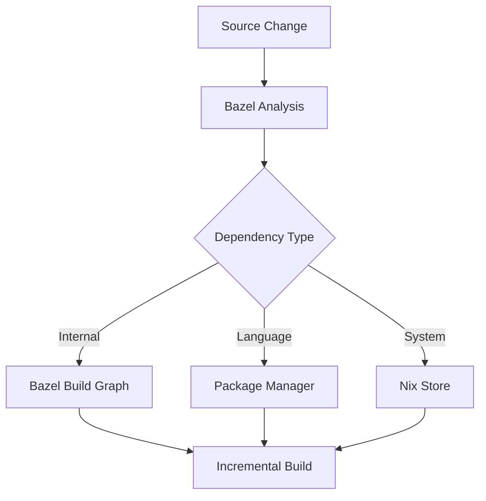

# Architecture Guide

This document explains the architectural principles, system design, and integration patterns that make this monorepo template effective for polyglot development.

## System Architecture

### Two-Layer Hermetic Environment

The core architectural principle is a **two-layer hermetic environment** that provides complete build reproducibility:

```
┌─────────────────────────────────────────────────────────┐
│ Nix Layer (System Dependencies)                        │
│ ├── Compilers (gcc, rustc, go, python)                │
│ ├── Build Tools (bazel, npm, cargo, uv)               │
│ ├── System Libraries (openssl, protobuf)              │
│ └── Development Tools (git, graphviz, awscli)         │
└─────────────────────────────────────────────────────────┘
                            │
┌─────────────────────────────────────────────────────────┐
│ Bazel Layer (Source Dependencies)                      │
│ ├── Source Code Modules                               │
│ ├── Language Dependencies (pip, npm, crates)          │
│ ├── Generated Code (protobuf, thrift)                 │
│ └── Build Artifacts                                   │
└─────────────────────────────────────────────────────────┘
```

### Integration Points

#### Nix → Bazel Integration

**rules_nixpkgs** creates the bridge between Nix and Bazel:

1. **Toolchain Provision**: Nix provides all compilers and build tools
2. **Hermetic Sandbox**: Bazel builds reference exact Nix store paths
3. **Dependency Resolution**: Complex C/C++ libraries come from nixpkgs
4. **Environment Consistency**: Same toolchain versions across all machines

#### Language-Specific Integration

Each language follows a consistent integration pattern:

```python
# MODULE.bazel - Declare language rules
bazel_dep(name = "rules_python", version = "0.31.0")

# BUILD.bazel - Use language rules  
load("@rules_python//python:defs.bzl", "py_binary")

py_binary(
    name = "app",
    srcs = ["main.py"],
    deps = ["//packages/shared:utils"],  # Internal deps
    # External deps handled by language tools (uv, npm, cargo)
)
```

## Dependency Management Strategy

### Three-Tier Dependency Model

1. **System Dependencies** (Nix)
   - Compilers, interpreters, system libraries
   - Development tools and utilities
   - Version pinned in `flake.nix`

2. **Language Dependencies** (Package Managers)
   - Python: `uv` with `pyproject.toml`
   - JavaScript: `npm` with `package.json`
   - Rust: `cargo` with `Cargo.toml`
   - Go: `go mod` with `go.mod`

3. **Internal Dependencies** (Bazel)
   - Source code modules within the monorepo
   - Generated code (protobuf, etc.)
   - Build artifacts and intermediates

### Dependency Resolution Flow



## Build System Design

### Hermetic Builds

Every build is **hermetic** - completely isolated and reproducible:

- **Input Completeness**: All inputs explicitly declared
- **Output Determinism**: Same inputs always produce same outputs  
- **Environment Isolation**: No access to undeclared system state
- **Version Pinning**: Exact versions for all dependencies

### Incremental Building

Bazel's build graph enables precise incremental builds:

1. **Change Detection**: Content-based hashing detects changes
2. **Affected Analysis**: Only rebuild dependent targets
3. **Parallel Execution**: Independent targets build concurrently
4. **Remote Caching**: Share build artifacts across machines

### Cross-Language Dependencies

The monorepo supports seamless cross-language dependencies:

```python
# Protocol Buffers generate code for multiple languages
proto_library(
    name = "user_proto",
    srcs = ["user.proto"],
)

# Python service depends on proto
py_binary(
    name = "user_service", 
    deps = [":user_py_proto"],
)

# Go client depends on same proto
go_binary(
    name = "user_client",
    deps = [":user_go_proto"], 
)
```

## Technology Integration Patterns

### Standard Integration Pattern

Each technology follows this pattern:

1. **Bazel Rules**: Add appropriate `rules_*` to MODULE.bazel
2. **System Tools**: Ensure compilers/tools available in flake.nix  
3. **Package Management**: Use language-native dependency management
4. **Build Targets**: Define BUILD.bazel files with proper visibility
5. **Testing**: Include test targets in same BUILD files

### Frontend Applications

```python
# Frontend builds and serves
js_binary(
    name = "dev_server",
    entry_point = "src/index.js",
    data = [":assets", "//packages/ui:components"],
)

# Production build  
js_library(
    name = "app_bundle",
    srcs = glob(["src/**/*.js"]),
    deps = ["@npm//react", "@npm//react-dom"],
)
```

### Backend Services

```python
# Service with internal and external deps
py_binary(
    name = "api_server",
    srcs = ["main.py"], 
    deps = [
        "//packages/database:models",      # Internal
        "//packages/api:user_py_proto",    # Generated
        "@pypi//fastapi",                  # External
    ],
)
```

### Infrastructure as Code

```python
# Infrastructure depends on applications
py_binary(
    name = "deploy",
    srcs = ["deploy.py"],
    data = [
        "//apps/backend:server",    # Ensures app builds before deploy
        "//apps/frontend:bundle",   # Frontend artifacts
    ],
)
```

## Scalability Considerations

### Monorepo Scale

This architecture scales effectively because:

- **Selective Builds**: Only affected targets rebuild
- **Parallel Execution**: Independent work happens concurrently  
- **Remote Execution**: Builds can run on powerful remote machines
- **Shared Caching**: Build artifacts shared across team
- **Precise Testing**: Only run tests for changed code

### Team Organization

```
├── teams/
│   ├── platform/        # Infrastructure, tooling, shared libraries
│   ├── backend/         # Backend services and APIs  
│   ├── frontend/        # Frontend applications
│   └── mobile/          # Mobile applications
```

### Deployment Boundaries

```python
# Each deployable unit has clear boundaries
deployment_group(
    name = "user_service",
    services = ["//apps/user-api:server"],
    configs = ["//infra/k8s:user-service"],
    tests = ["//apps/user-api:integration_tests"],
)
```

## Security and Compliance

### Supply Chain Security

- **Dependency Pinning**: All dependencies have exact versions
- **Hermetic Builds**: No network access during builds
- **Reproducible Artifacts**: Bit-for-bit identical builds
- **Audit Trail**: Complete dependency provenance

### Code Organization

- **Visibility Controls**: Bazel visibility rules prevent unwanted dependencies
- **API Boundaries**: Clear interfaces between components
- **Test Isolation**: Tests run in isolated environments
- **Secret Management**: No secrets in source code or build artifacts

## Monitoring and Observability

### Build Metrics

- Build times and cache hit rates
- Dependency graph complexity
- Test execution times
- Resource utilization

### Development Metrics

- Code change impact analysis
- Cross-team dependency coupling
- Build success rates
- Developer productivity

This architecture enables teams to build complex, polyglot systems while maintaining the benefits of a monorepo: shared code, atomic changes, and unified tooling.